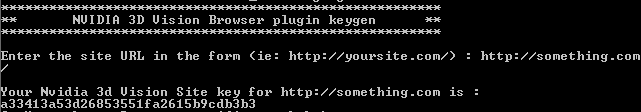

# Nvidia3DVisionBrowserPluginKeygen

Run on Win32 platform only (may works under Linux using Wine)

## Goal 

Some people are still using Nvidia 3d Vision glasses.

One of the features of this device is to allow its owners to see 3D images through their web browser, using a plugin.

It seems that if a web content provider want to provide 3d images (JPS format for instance), they need to register for a "key" that need to be setup within the html code of the website.

Without this "key", the browser plugin will refuse to display images with the following error message : "Invalid Authentication provided. Please contact NVIDIA for plugin usage"

Since Nvidia doesn't support this device anymore, it is not possible anymore to new web content providers to provide this 3D Vision feature on their website.

The goal of this tool is to generate the needed "key" to embed into your web pages so that users that own a 3D vision (and the necessary plugin) be able to watch 3D images on your website.


## Usage :

### Run the exe

If you trust my code (which you should never), just run the kg.exe from a command prompt.

### Or build it

The exe was build using mingw-32, you can get it from http://win-builds.org/doku.php/download_and_installation_from_windows

Install the 32 bits version (i686 choice in the installer)

Then, you can build the exe using the following command (don't worry about warnings)

```
g++.exe -std=c++11 -g kg.c -o kg.exe

```

### Next



It will ask you for the url of your website root (ie : http://www.mywebsite.com)

It will then provide you with the neede key.

You will then need to add the "key" in your html code with something like this :


```
<embed regex="*" key="THE_GENERATED_KEY" mime-type="image/jps" type="image/jps" src="Your3DImage.jpg" width="1024" height="704">
```

That's all :)

